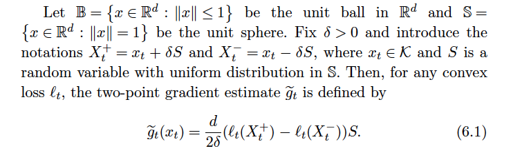

Linear Bandits II
========================================================
author: 
date: 

Overview
========================================================
-  Detour to convex analysis
-  OMD and OSMD

Subgradient and Legendre-Fenchel transfrom
========================================================

**Def**: Let $\mathcal{X} \subseteq \mathbb{R}^{d}$. A function $f: \mathcal{X} \rightarrow \mathbb{R}$ is subdifferentiable if for $\forall x \in \mathcal{X}$, $\exists g \in \mathbb{R}^d$ such that
$$
f(x) - f(y) \le g^T(x-y) \quad \forall y \in \mathcal{X}.
$$
Then $g$ is called a subgradient of $f$ at $x$.  

**Def**: Let $f: \mathcal{X} \rightarrow \mathbb{R}$ be a convex function defined on a convex set $\mathcal{X} \subseteq \mathbb{R}^{d}$. The Legendre-Fenchel transform of $f$ is defined by:
$$
f^{*}(u) = \underset{x \in \mathcal{X}}{\mathrm{sup}}(x^Tu-f(x)).
$$

This implies $u^Tx \le f(x) + f^{*}(u)$. (**Fenchel-Young inequality**  )

Legendre function and Bregman divergence
========================================================

**Def**: A continuous function $F: \bar{\mathcal{D}} \rightarrow \mathbb{R}$ is **Legendre** if  
1. F is strictly convex and admits continuous first partial derivatives on $\mathcal{D}$  
2. $\underset{x\rightarrow \text{bd of } \mathcal{D}}{lim}\lVert \nabla F(x) \rVert = +\infty$

**Bregman Divergence**: $D_F: \bar{\mathcal{D}} \times \mathcal{D} \rightarrow \mathbb{R}$ associated with a Legendre function $F$ is defined by 
$$
D_F(x,y) = F(x) - F(y) - (x-y)^T \nabla F(y)
$$
**Properties**:  
1. $\mathcal{D}^{*} = \nabla F(\mathcal{D})$ is the dual space of $\mathcal{D}$ under $F$.  
2. $D_F(x,y) > 0, x \ne y$ and $D_F(x,y) = 0, x = y$

Legendre function and Bregman divergence
========================================================

The gradient $\nabla F$ maps $\mathcal{D}$ to the dual space $\mathcal{D}^{*}$ and $\nabla F^{*}$ is the inverse mapping  dual $\rightarrow$ primal.  

**Lemma5.3**: Let $F$ be a Legendre function. Then $F^{**} = F$ and $\nabla F^{*} = (\nabla F)^{-1}$ restricted on the set $\mathcal{D}^{*}$. Moreover, for all $x,y \in \mathcal{D}$,
$$
D_F(x,y) = D_{F^{*}}(\nabla F(y),\nabla F(x))
$$

This lemma means: the Bregman divergence in the primal exactly corresponds to the Bregman divergence of the Legendre transform in the dual.

Generalized Pythagorean inequality
========================================================
Let $\mathcal{K}\subseteq \bar{\mathcal{D}}$ be a closed convex set such that $\mathcal{K}\cap\mathcal{D} \ne \emptyset$. Then, for all $x\in \mathcal{D}$, the Bregman projection
$$
z = \underset{y\in\mathcal{K}}{\mathrm{argmin}}D_F(y,x)
$$
exists and is unique. Moreover, for all $z \in \mathcal{K}\cap\mathcal{D}$ and $y \in \mathcal{K}$,
$$
D_F(y,x) \ge D_F(y,z)+D_F(z,x).
$$
 
(Analog to squared Euclidean distance)

Online Mirror Descent(OMD) strategy
========================================================
**Input parameters**: compact and convex set $\mathcal{K}\subseteq\mathbb{R}^d$, learning rate $\eta>0$, Legendre function $F$ on $\bar{\mathcal{D}}\supset \mathcal{K}$.  
Initialize: $x_1 \in \underset{x\in\mathcal{K}}{\mathrm{argmin}}F(x)$  
For each round(time) $t = 1,2,\dots,n$:  
1.  Play $x_t$ and observe loss vector $l_t$ (not just inner product).  
2.  $w_{t+1} = \nabla F^{*}(\nabla F(x_t) - \eta \nabla l_t(x_t))$.  
3.  Project back to $\mathcal{K}$: $x_{t+1} = \underset{y \in \mathcal{K}}{\mathrm{argmin}}D_F(y,w_{t+1})$.

Regret of OMD with a Legendre function
========================================================
**Theorem 5.5**. Let $\mathcal{K}$ be a compact and convex set of arms, L be a set of subdifferentiable functions, and F be a Legendre function defined on $\mathcal{D} \supset \mathcal{K}$, such that Equation (5.3) is satisfied. Then OMD satisfies for any $x\in \mathcal{K}$,
$$
\sum_{t=1}^{n}l_t(x_t) - \sum_{t=1}^{n}l_t(x) = \frac{F(x) - F(x_1)}{\eta} + \\
\frac{1}{\eta}\sum_{t=1}^{n}D_{F^*}(\nabla F(x_t)-\eta\nabla l_t(x_t),\nabla F(x_t)).
$$
Proof: Book and handout

Regret of OMD with non-Legendre function
========================================================
**Theorem 5.6**. Let $\mathcal{K}$ be a compact set of actions, $\mathcal{L}$ be a set of subdifferentiable functions, and $F$ be a function with effective domain $\mathcal{K}$ such that $F^*$ is
differentiable on $\mathbb{R}^d$. Then for any $x \in \mathcal{K}$ OMD satisfies
$$
\sum_{t=1}^{n}l_t(x_t) - \sum_{t=1}^{n}l_t(x) = \frac{F(x) - F(x_1)}{\eta} + \\
\frac{1}{\eta}\sum_{t=1}^{n}D_{F^*}(-\eta\sum_{s=1}^{t}\nabla l_s(x_s),-\eta\sum_{s=1}^{t-1}\nabla l_s(x_s)).
$$
Proof: Book and handout

Online Stochastic Mirror Descent (OSMD) strategy
========================================================
When gradient information is not available - OSMD.  

**Input parameters**: compact and convex set $\mathcal{K}\subseteq\mathbb{R}^d$, learning rate $\eta>0$, Legendre function $F$ on $\bar{\mathcal{D}}\supset \mathcal{K}$.  
Initialize: $x_1 \in \underset{x\in\mathcal{K}}{\mathrm{argmin}}F(x)$   
For each round(time) $t = 1,2,\dots,n$:  
1.  Play a random perturbation $\tilde{x}_t$ of $x_t$ and observe loss $l_t(\tilde{x}_t)$.  
2.  Compute random estimate $\tilde{g}_t$ of $\nabla l_t(x_t)$.  
3.  $w_{t+1} = \nabla F^{*}(\nabla F(x_t) - \eta \tilde{g}_t)$.    
4.  Project back to $\mathcal{K}$: $x_{t+1} = \underset{y \in \mathcal{K}}{\mathrm{argmin}}D_F(y,w_{t+1})$.

Online Stochastic Mirror Descent (OSMD) strategy
========================================================

**Difference:**   
At time $t$, play a perturbation of $x_t$: $\tilde{x}_t$.  
$\nabla l_t(x_t) \rightarrow \tilde{g}_t$

An example of the estimate of gradient $\tilde{g}_t$:  

